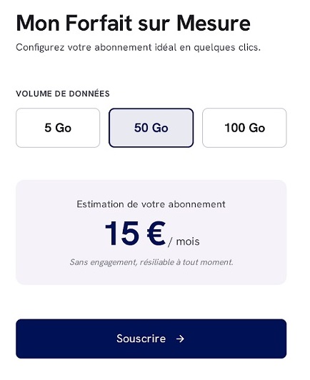
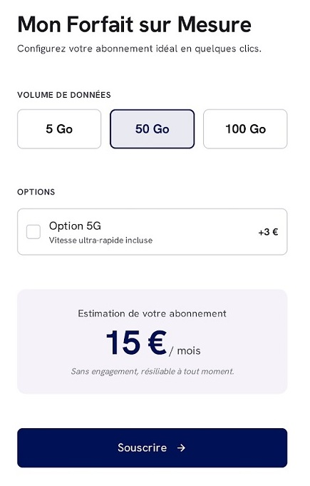
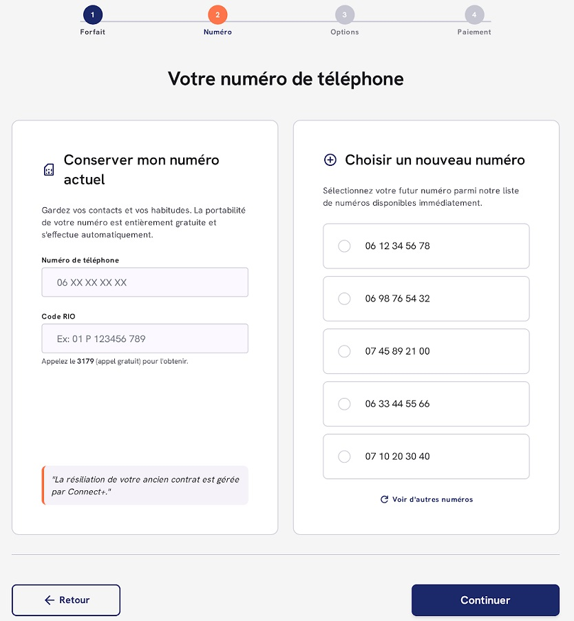
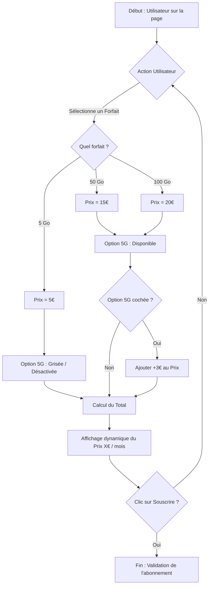
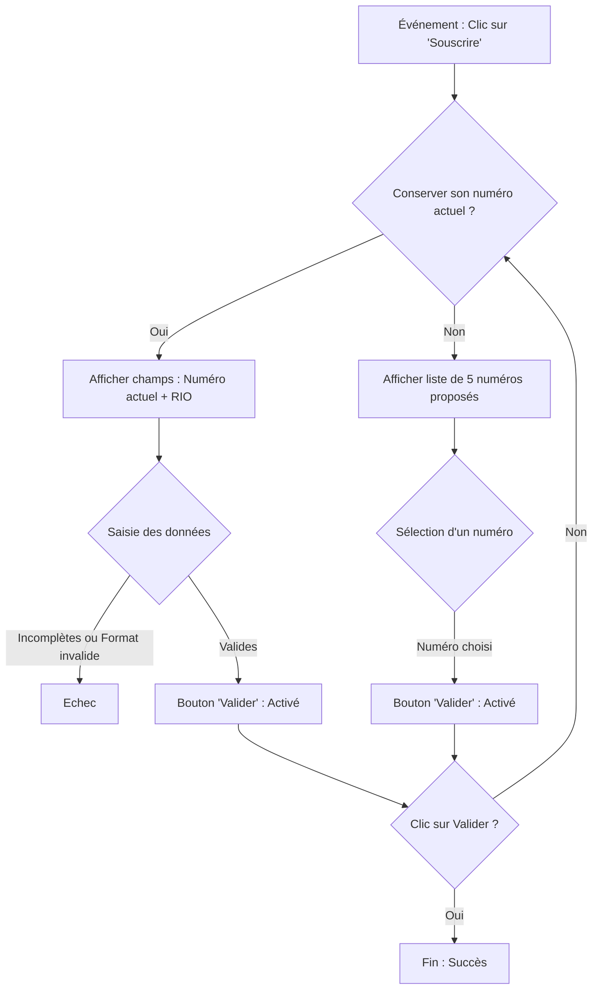

# Scénarisation

Traduire une interface visuelle en une suite logique d'actions, de conditions et d'événements utilisateur

Rédiger **une spécification fonctionnelle / un scénario logique** sous forme d'étapes textuelles ou d'un logigramme textuel.

## Exercice 1 : Mon forfait Mobile

Vous recevez la maquette d'une page de sélection d'abonnement mobile Connect+ et devez rédiger le scénario nominal.

### Structure de la maquette : 

1. Un titre : **"Mon Forfait sur Mesure"**.
2. 3 blocs représentants les forfaits : **5 Go**, **50 Go**, **100 Go**.
3. Un affichage dynamique du prix : **X € / mois**.
4. Un bouton **"Souscrire"**.

#### Règles de gestion

* 5 Go = 5 € / mois
* 50 Go = 15 € / mois
* 100 Go = 20 € / mois

### La maquette v2

Vous recevez une mise à jour de la maquette de la page de sélection d'abonnement mobile. Mettez à jour le scénario nominal et rédigez le scénario alternatif.

**Ajouts :**

1. Une Checkbox (Case à cocher) : **"Option 5G"** (qui doit être grisée/désactivée si le curseur est sur 5 Go).

#### Règles de gestion supplémentaires

* L'option 5G n'est pas disponible pour le forfait 5 Go.

## Exercice 1.2 : Mon numéro

L'utilisateur a sélectionné son forfait et cliqué sur "Souscrire". L'étape suivante demande à l'utilisateur de choisir s'il souhaite conserver son numéro actuel ou bénéficier d'un nouveau numéro.

Rédigez les scénarios : 

1. L'utilisateur souhaite conserver son numéro actuel.
2. L'utilisateur souhaite un nouveau numéro.

# Corrections

---

