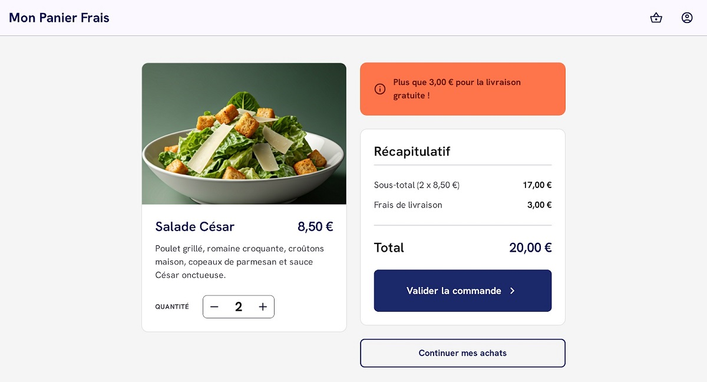
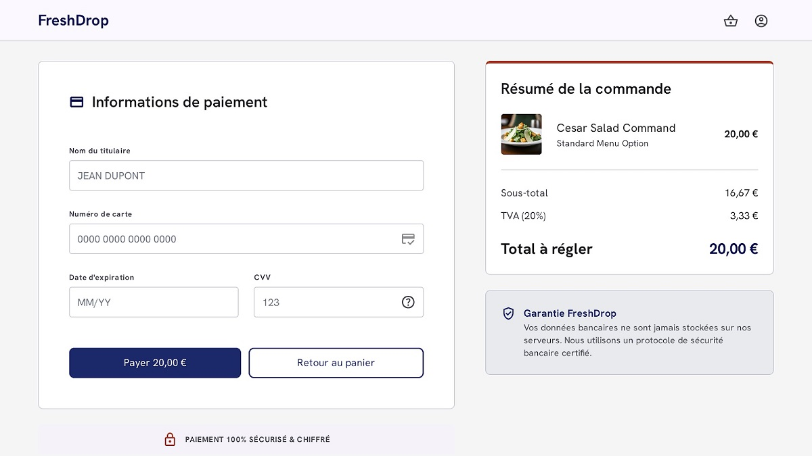

# Scénarisation

## Exercice 2 : Mes salades

Vous recevez la maquette d'une interface de commande de salades composées. Vous devez évaluer comment l'interface réagit en fonction des choix de l'utilisateur.

### Structure de la maquette :

1. Une fiche produit : **"Salade César"** (Prix unitaire : **8,50 €**).
2. Un sélecteur de quantité : boutons **[ - ]** et **[ + ]** entourant le nombre d'articles.
3. Un récapitulatif dynamique :
* Ligne **"Sous-total"** (Prix total des salades).
* Ligne **"Frais de livraison"** (3,00 € ou Gratuit).
* Ligne **"Total à payer"**.

4. Une zone de message d'information (Bandeau de feedback).
5. Un bouton **"Valider la commande"**.

#### Règles de gestion

* Prix d'une salade = **8,50 €**.
* Frais de livraison standards = **3,00 €**.
* **Seuil de gratuité** : La livraison devient gratuite si le sous-total atteint ou dépasse **20,00 €**.
* **Commande minimale** : Cliquer sur "Valider la commande" affiche une erreur si le panier est vide.

---

---

### Travail demandé

#### 1. Scénario Nominal : "Atteindre la gratuité"

Rédigez les étapes logiques lorsque l'utilisateur augmente la quantité jusqu'à obtenir la livraison offerte.

* **État initial** : Le panier contient 1 salade.
* **Action** : L'utilisateur clique deux fois sur le bouton **[ + ]**.
* **Résultat attendu** : Décrivez l'évolution des prix, du message d'information et de la ligne de livraison.

#### 2. Scénario Alternatif : "Le panier vide"

Rédigez les étapes logiques lorsque l'utilisateur retire tous ses articles.

* **Action** : L'utilisateur clique sur le bouton **[ - ]** jusqu'à atteindre 0.
* **Résultat attendu** : Décrivez l'état du bouton de validation et le message affiché à l'écran.

---

## Exercice 2.1 : Payer mes salades

L'utilisateur a validé son panier et arrive sur l'écran de paiement. 

En vous basant sur la maquette ci-dessus, rédigez les scénarios jusqu'à la validation du paiement par l'utilisateur.

1. Le scénario nominal .
2. Le cas où l'utilisateur clique sur "Retour au Panier"
2. Le cas où l'utilsateur clique sur "Payer" mais que le formulaire est incomplet.

