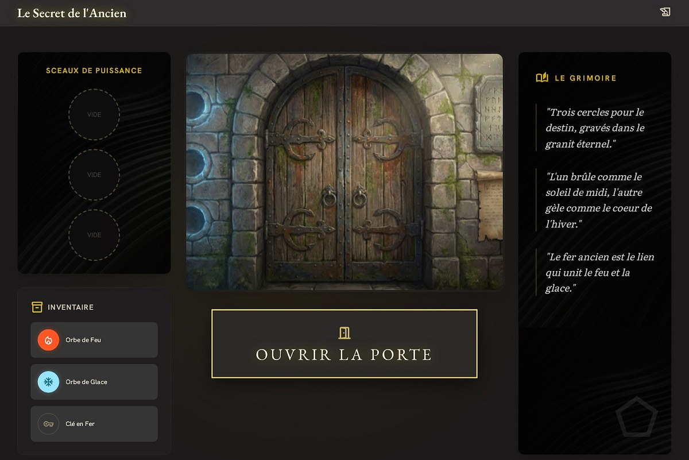

# Scénarisation

## Exercice 4 : Le Donjon de l'Alchimiste

Vous recevez la maquette d'une interface de jeu d'énigme et devez scénariser la gestion de l'inventaire et les mécanismes de déverrouillage d'une porte secrète.

### Structure de la maquette :

1. **La Zone d'Action** : Une illustration d'une grande porte médiévale avec trois emplacements circulaires vides alignés verticalement à gauche de la porte.
2. **L'Inventaire** : 3 objets cliquables : **Orbe de Feu**, **Orbe de Glace**, **Clé en Fer**.
3. **Le Grimoire (Indices)** : A droite de la porte, un texte qui change selon les objets insérés.
4. **Le Bouton d'Action** : **"Ouvrir la porte"**.

#### Règles de gestion

* **Mécanisme d'ouverture** : La porte ne s'ouvre que si les objets sont placés dans cet ordre (de haut en bas): 
    - l'**Orbe de Feu** en haut
    - **Emplacement vide** au milieu
    - l'**Orbe de Glace** en bas.
* **Incompatibilité** : On ne peut pas placer deux fois le même objet. Si l'utilisateur place l'Orbe de Feu en bas alors qu'il est déjà au milieu, il change simplement de place.
* **La Clé en Fer** : Elle ne sert pas pour la porte (c'est un "piège" logique), elle doit afficher un message : *"La serrure semble magique, une clé physique est inutile ici."*
* **États de la porte** :
    * Vide : "La porte est scellée par le vide."
    * Mauvaise combinaison : "Les énergies s'opposent, la porte vibre dangereusement."
    * Bonne combinaison : "Une lueur dorée apparaît, le mécanisme s'enclenche."

---

### Travail demandé

#### 1. Scénario Nominal : "L'ouverture réussie"

L'utilisateur veut ouvrir la porte. Décrivez la suite d'actions pour réussir.

* **Actions** : Placement des orbes dans le bon ordre.

#### 2. Scénario Alternatif : "L'erreur d'élément"

Les éléments sont mal placés.

* **Résultat attendu** : 
     - Quel message affiche le Grimoire ? 
     - Que se passe-t-il si l'utilisateur clique sur "Ouvrir la porte" dans cet état ?

#### 3. Gestion de l'inventaire (Logique de transfert)

* **Action** : L'Orbe de Feu est déjà en haut. L'utilisateur clique sur l'emplacement du milieu pour y mettre l'Orbe de Feu.
* **Résultat attendu** : Expliquez comment les objets se déplacent graphiquement (l'emplacement du haut redevenant vide).
