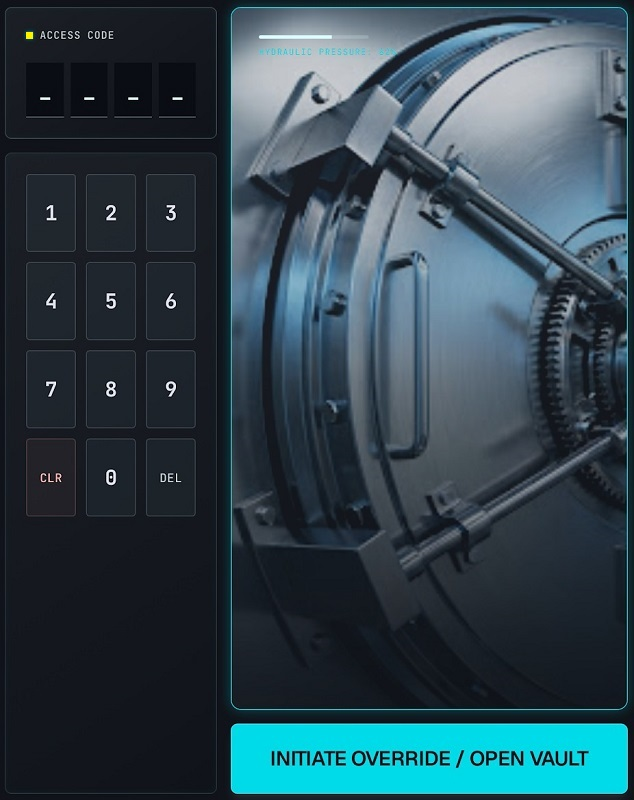

# Scénarisation

## Exercice 4.2 : Le Coffre récalcitrant

Vous devez scénariser la gestion d'un état complexe : une séquence de chiffres qui doit correspondre à une solution précise, tout en gérant les interactions de saisie et de réinitialisation.

### Structure de la maquette :

1. **L'Affichage** : Un écran digital affichant 4 tirets par défaut.
2. **Le Pavé Numérique** : 10 boutons (chiffres de 0 à 9).
3. **Les Commandes** :
    * Bouton **[ CLR ]** (Effacer le dernier chiffre saisi).
    * Bouton **[ DEL ]** (Effacer tout).
4. Sur la droite, l'image d'un coffre-fort
5. Sous l'image, un bouton **[ Open Vault ]** 
    - Cliquer sur ce bouton lance la vérification du code
    - Code correct = la porte s'ouvre
    - Code incorrect = la porte reste fermée
6. **Indicateurs Lumineux** :
    * Une LED allumée en **Jaune** pendant la saisie.
    * Au clic sur le bouton de validation, La LED passe au **vert** (Succès) ou au **Rouge** (Échec).

#### Règles de gestion

* **Saisie** : Chaque clic sur un chiffre remplace le tiret le plus à gauche encore libre.
* **Limite** : Une fois les 4 chiffres saisis, les boutons numériques deviennent inactifs (on ne peut pas saisir 5 chiffres).
* **Combinaison Secrète** : La porte ne s'ouvre que si le code est **`2 6 0 5`**.
* **Validation** : Le bouton "Open Vault" ne devient cliquable que lorsque les 4 chiffres sont saisis.
* **Corriger la saisie** : Le bouton **[ CLR ]** supprime le chiffre saisi le plus à droite. Aucun effet si pas de chiffre saisi.
* **Réinitialisation** : Le bouton **[ DEL ]** vide l'affichage et remet les tirets, quel que soit le nombre de chiffres déjà saisis.

---

### Travail demandé

#### 1. Scénario Nominal

L'utilisateur connaît le code et souhaite ouvrir le coffre.

* **Actions** : Détaillez la suite de clics sur le pavé numérique.
* **Résultat attendu** : Décrivez l'état de la LED et le message à l'écran après avoir cliqué sur "Open Vault".

#### 2. Scénario Alternatif : "L'erreur de code"

L'utilisateur un code incorrect.

* **Actions** : Saisie complète et clic sur "Open Vault".
* **Résultat attendu** : Décrivez la réaction de la LED et ce qu'il advient de l'affichage (par ex. le code reste-t-il affiché ou s'efface-t-il automatiquement ?).

#### 3. Logique de correction : "L'erreur de saisie"

L'utilisateur a saisi 4 chiffres chiffres (`2 6 0 1`) et se rend compte de son erreur.

* **Action** : L'utilisateur clique sur **[ CLR ]**.
* **Résultat attendu** : Expliquez l'état de l'affichage et du bouton de validation.
