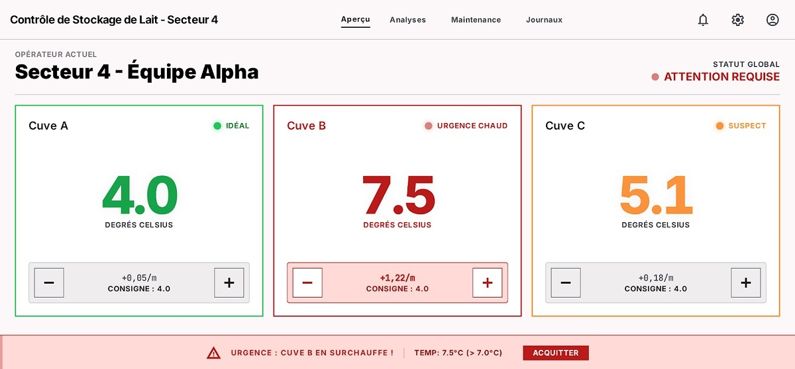

# Scénarisation

## Exercice 5 : La Laiterie Connectée

Vous devez scénariser l'interface de contrôle de trois cuves de stockage de lait. L'objectif est de surveiller la température et d'agir afin de maintenir une temérature idéale de conservation.

### Structure de la maquette :

1. **Tableau de bord** : 3 cadrans représentant les **Cuves A, B et C**.
2. **Affichage des données** : Sous chaque cadran, la température actuelle en **°C**.
    - 1ere cuve: 4°C
    - 2eme cuve: 7.5°C
    - 3eme cuve: 5.1°C
3. **Commandes de température** : sous chaque temperature affichée, 2 boutons "-" et "+" pour agir sur la température.
4. **Indicateurs visuels** : La couleur du cadran change selon la température.
5. **Zone d'alerte** : Un message textuel global pour l'opérateur si la température dépasse un seuil critique.

#### Règles de gestion

* **Seuils de température** :
* **Entre 0°C et 1.9°C** : Température critique (trop froid) (Couleur : **bleu**).
* **Entre 2°C et 4°C** : Température idéale (Couleur : **Vert**).
* **Entre 4.1°C et 7°C** : Température suspecte (Couleur : **Orange**).
* **Au-dessus de 7°C** : Température critique (trop chaud) (Couleur : **Rouge**).

* **Automatisme** : 
    - Si une cuve passe en **Rouge**, le message d'alerte doit afficher : *"Urgence : Cuve [Nom] en surchauffe !"*.* 
    - Si une cuve passe en **bleu**, le message d'alerte doit afficher : *"Urgence : Cuve [Nom] trop froid !"*.
