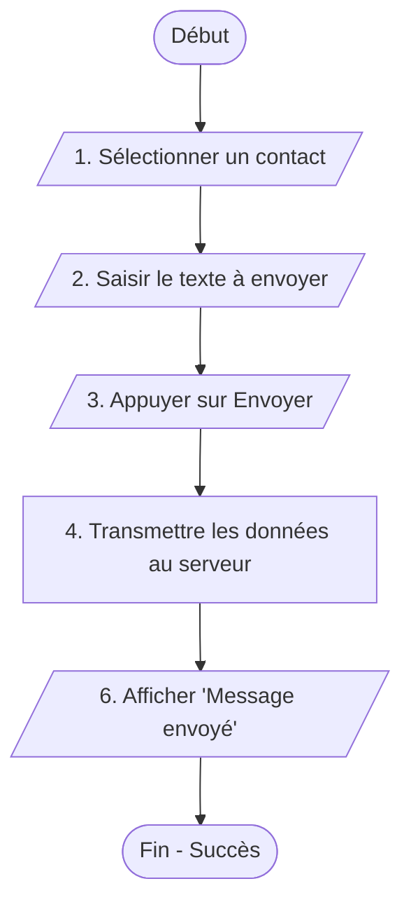
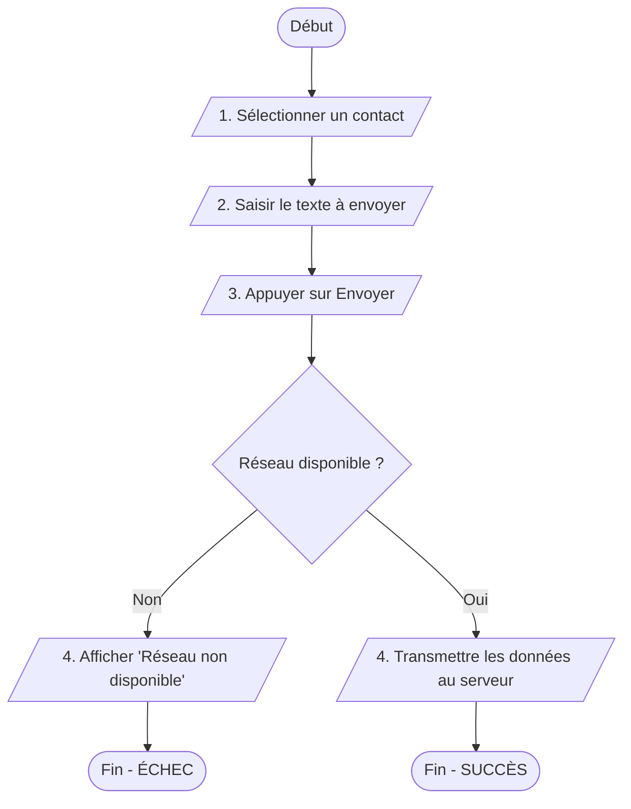

# Cours : Organigrammes et Pseudo-Code

## Algorithme : Kesako ?

Un algorithme est une recette logique qui peut s'exprimer sous deux formes  : 
- le **pseudo-code** (textuel)
- l'**organigramme** (visuel). 

L'**organigramme** excelle dans la phase de conception initiale, car il permet de visualiser instantanément les branchements complexes et les boucles, facilitant ainsi la détection d'impasses logiques. 

Le **pseudo-code** offre une précision et une compacité proches du code réel, ce qui facilite la traduction finale vers un langage de programmation, bien qu'il soit moins intuitif pour appréhender la structure globale d'un algorithme. 

**Dans quels cas utiliser les deux ?** 

L'usage conjoint est nécessaire lors de la conception de **systèmes critiques ou complexes** : l'organigramme sert alors de "carte routière" pour valider l'architecture du processus avec les parties prenantes, tandis que le pseudo-code sert de "plan de montage" détaillé pour les développeurs.

## L'organigramme (Flowchart)

Un **organigramme** est une représentation graphique d'un algorithme. Il permet de voir d'un coup d'œil les **boucles**, les **décisions** et le **cheminement** des données.

### 1. Les symboles standards

| Symbole | Nom | Fonction |
| :--- | :--- | :--- |
| **Ovale** | Début / Fin | Marque le départ et l'arrivée de l'algorithme. |
| **Rectangle** | Action / Traitement | Une étape du processus (ex: "Calculer le prix"). |
| **Losange** | Décision / Test | Une question qui sépare le flux en deux (Oui / Non). |
| **Parallélogramme** | Entrée / Sortie | Une interaction (ex: "Lire l'âge", "Afficher Message"). |

<div style="page-break-after:always;"></div>

### 2. Exemple : Scénario d'envoi de SMS

L'organigramme ci-dessous traduit le scénario **nominal** d'envoi de SMS.



<div style="page-break-after:always;"></div>

L'organigramme suivant intègre le **Scénario Nominal** et une **Exception**.



<div style="page-break-after:always;"></div>

### 3. Pourquoi utiliser l'organigramme ?

1.  **C'est universel** : On peut le montrer à un client ou à un autre développeur sans qu'il ait besoin de connaître un langage spécifique.
2.  **C'est un détecteur de bugs** : Si vous avez une flèche qui ne mène nulle part ou une boucle infinie, vous le verrez tout de suite visuellement.
3.  **L'indentation visuelle** : Le losange force à réfléchir à ce qui se passe quand ça ne marche pas (la branche "Non"), ce qu'on oublie souvent en écrivant.

> **Conseil :** Dessiner l'organigramme **après** avoir rédigé le scénario, et **avant** le pseudo-code.
> *   **Scénario** : On comprend le besoin.
> *   **Organigramme** : On structure la logique visuelle.
> *   **Pseudo-code** : On prépare la structure du futur code.

<div style="page-break-after:always;"></div>

## Le Pseudo-Code


Le pseudo-code est un langage intermédiaire entre le français et la programmation. Il permet de se concentrer sur la **logique** sans s'inquiéter de la syntaxe d'un langage de programmation.

> Le pseudo-code n'est pas un langage informatique rigide, mais une **convention d'écriture**.

### 1. Les briques de base (Les mots-clés)

Pour que tout le monde se comprenne, on utilise toujours les mêmes mots-clés :

*   **VARIABLES** : Les boîtes dans lesquelles on stocke des informations.
*   **LIRE** : Demander une information à l'utilisateur.
*   **AFFICHER** : Donner une information ou un résultat.
*   **SI / ALORS / SINON / SINON SI** : Prendre une décision.
*   **TANT QUE / FAIRE** : Répéter une action.

### 2. La structure d'un algorithme

Un algorithme se rédige toujours de la manière suivante :

```text
ALGORITHME Nom_De_L_Algorithme
VARIABLES
    Nom_De_La_Variable : Type (Nombre, Texte, ou Booléen)
DEBUT
    // Ici, on écrit les instructions
FIN
```

### 3. Exemples concrets

#### Exemple 1 : L'envoi de SMS

```text
ALGORITHME Envoi_SMS_Nominal

VARIABLES
    Contact : Texte
    Message_Texte : Texte
    Etat_Envoi : Booléen

DEBUT
    AFFICHER "Ouverture de l'application"
    AFFICHER "Veuillez sélectionner un contact :"
    LIRE Contact

    AFFICHER "Saisissez votre message :"
    LIRE Message_Texte
    
    AFFICHER "Appui sur le bouton Envoyer..."
    AFFICHER "Envoi du message en cours..."
    AFFICHER "Message envoyé"
FIN
```

#### Exemple 2 : Le test de température (Conditionnel)

*Objectif : Dire si l'eau bout.*

```text
ALGORITHME Alerte_Cuisson
VARIABLES
    Temperature : Nombre
DEBUT
    LIRE Temperature
    SI Temperature >= 100 ALORS
        AFFICHER "L'eau bout !"
    SINON
        AFFICHER "L'eau est encore froide ou tiède."
    FIN SI
FIN
```

### 4. Les règles d'or de la syntaxe

1.  **L'Indentation** : On décale toujours vers la droite les instructions à l'intérieur d'un **SI** ou d'un **TANT QUE**. Cela permet de voir d'un coup d'œil où commence et où finit une décision.
2.  **L'Affectation (`<-`)** : On utilise une flèche pour dire "mettre cette valeur dans cette boîte".
    *   *Exemple : `Age <- 25` (On met 25 dans la variable Age).*
3.  **La Clarté** : Les noms de variables doivent être explicites. Préférez `Prix_Unitaire` à `P`.
