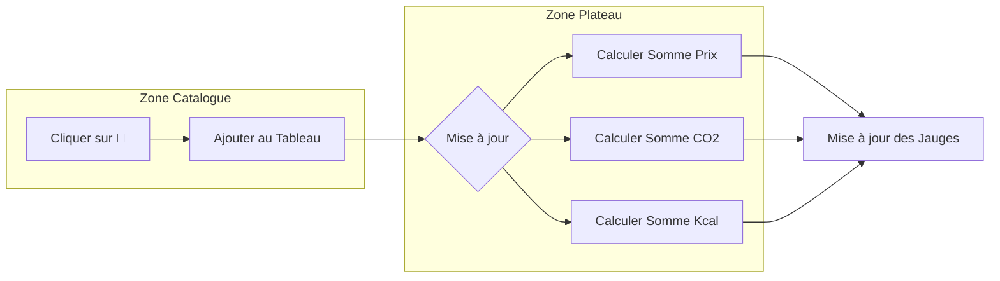

Voici une liste d'aliments structurée pour ton projet **Eco-Calculateur**, avec des icônes UTF-8 et des données cohérentes pour les exercices de tes apprenants.

### 💡 Conseil pédagogique pour tes groupes

Pour faciliter l'apprentissage sur deux semaines, tu peux leur donner cette liste sous forme de **fichier JSON**. Cela leur apprendra à importer des données externes, une compétence clé pour le titre professionnel :

```json
[
  { "id": 1, "nom": "Steak", "img": "🥩", "cal": 250, "co2": 1500, "prix": 4.5 },
  { "id": 2, "nom": "Frites", "img": "🍟", "cal": 310, "co2": 200, "prix": 2.5 }
]

```

Je comprends tout à fait, le rythme en reconversion doit laisser la place à l'assimilation, surtout quand on gère en plus des situations de handicap qui peuvent impacter la fatigabilité ou la concentration.

Pour une période de **1 à 2 semaines**, le projet **"L'Éco-Calculateur de Lunch"** est parfait : il est gratifiant, visuellement parlant, et permet de décomposer chaque étape technique sans mettre les apprenants en situation de surcharge cognitive.

Voici comment on pourrait le structurer pour qu'ils progressent sereinement :

---

## 🥗 Projet : Mon Plateau Repas Éco-Responsable

L'objectif est de créer une application où l'on compose son plateau repas et où l'on voit instantanément l'impact écologique et le prix.

### Étape 1 : Préparation des données (2-3 jours)

On commence par manipuler des objets simples. C'est l'étape où ils apprennent à structurer l'information.

* **La liste des aliments** : Créer un tableau d'objets (ex: `[{nom: "Burger", carbone: 2500, prix: 8, image: "🍔"}, ...]`).
* **Affichage** : Utiliser une boucle pour afficher chaque aliment sous forme de "carte" cliquable.

### Étape 2 : La logique du Plateau (3-4 jours)

C'est ici qu'on gère les interactions.

* **Ajouter au panier** : Au clic sur un aliment, il s'ajoute à une liste "Mon Plateau".
* **Calculer le total** : Créer une fonction qui additionne les prix et une autre pour le CO2.
* **Supprimer** : Pouvoir retirer un aliment du plateau si on a changé d'avis.

### Étape 3 : Le Feedback Visuel (3 jours)

On rend l'application ludique et "professionnelle".

* **Le thermomètre écologique** : Une barre qui se remplit. Elle est verte au début, puis devient rouge si le total CO2 dépasse un certain chiffre.
* **Les messages** : "Bravo, repas léger en carbone !" ou "Attention, ce repas pèse lourd sur la planète".

### Étape 4 : Peaufinage et Accessibilité (Fin de la 2ème semaine)

C'est l'étape cruciale pour leur futur métier.

* **Design** : Rendre l'interface propre (CSS).
* **Accessibilité** : S'assurer que les boutons ont des noms clairs pour les lecteurs d'écran et que les contrastes de couleurs sont suffisants.

---

### Pourquoi ce projet est sécurisant pour eux ?

* **Zéro stress algorithmique** : On reste sur des additions simples et des listes.
* **Visuel et concret** : Ils voient tout de suite le résultat de leur code (l'aliment apparaît sur le plateau).
* **Valorisation** : À la fin, ils ont une application complète, utile et sensibilisante à montrer en jury.


Pour une interface destinée à des profils en reconversion et en situation de handicap, la clarté visuelle et la réduction de la charge cognitive sont vos meilleures alliées. Voici une proposition d'organisation pour votre application **Eco-Calculateur** :

### 1. Structure de l'écran (Monopage)

Divisez l'écran en deux zones distinctes pour éviter les allers-retours fatigants :

* **À gauche : La "Cantine" (Catalogue)** : Une grille de cartes larges. Chaque carte affiche l'icône UTF-8 en gros, le nom de l'aliment, et ses trois indicateurs (Prix, CO2, Calories).
* **À droite : "Mon Plateau" (Panier)** : Une zone persistante qui liste les éléments ajoutés. C'est ici que l'utilisateur voit son repas se construire en temps réel.

---

### 2. Design des cartes "Aliments"

Utilisez des éléments visuels forts pour faciliter la lecture :

| Élément | Format suggéré |
| --- | --- |
| **Icône** | Taille XL (ex: 40px) pour une reconnaissance immédiate. |
| **Bouton Ajouter** | Un gros bouton **[ + ]** bien contrasté. |
| **Indicateurs** | Utilisez des pastilles de couleurs discrètes pour les chiffres (ex: bleu pour calories, marron pour CO2). |

---

### 3. Le Tableau de Bord (Dashboard)

Placez-le en haut ou en bas du plateau. Il doit récapituler les trois totaux avec des jauges visuelles :

* **Jauge Santé (⚡)** : Elle se remplit au fur et à mesure. Elle passe à l'orange à 800 kcal et au rouge à 1200 kcal.
* **Jauge Planète (🌍)** : Une barre qui devient rouge si le bilan carbone est trop lourd.
* **Total Portefeuille (💰)** : Un affichage simple du prix cumulé.

---

### 4. Accessibilité et Ergonomie (Points clés pour vos groupes)

Conformément aux besoins de vos apprenants en situation de handicap :

* **Pas de Drag & Drop** : Le "glisser-déposer" peut être difficile à manipuler. Un simple clic sur un bouton **[ + ]** pour ajouter et **[ 🗑️ ]** pour supprimer est bien plus accessible.
* **Contrastes élevés** : Assurez-vous que le texte noir sur fond blanc (ou l'inverse) est respecté.
* **Taille des cibles** : Des boutons de 44x44 pixels minimum pour faciliter le clic, même avec des tremblements ou une précision réduite.

---

### 5. Logique d'interaction (Mermaid)




C'est une excellente vision d'interface. Cette structure permet de séparer nettement la phase de "choix" (les carrousels) de la phase de "visualisation" (le plateau), ce qui est idéal pour des sessions de travail d'une à deux semaines.

Voici une proposition de conception centrée sur l'expérience utilisateur et l'accessibilité :

---

## 🏗️ L'Interface "Eco-Plateau"

### À Gauche : Les Carrousels de Sélection

Au lieu d'une longue liste fatigante, on utilise des lignes horizontales par catégories.

* **Catégories** : Une ligne "Plats", une ligne "Accompagnements", une ligne "Boissons/Desserts".
* **Navigation** : Des flèches **[ < ]** et **[ > ]** larges de chaque côté des sliders pour faire défiler les aliments sans effort de précision excessif.
* **Interaction** : Un clic sur la carte de l'aliment (ex: 🍕) l'envoie directement sur le plateau à droite.

### À Droite : Le Plateau (Vue de Haut)

C'est la zone de résultat, très visuelle.

* **Le Visuel** : Une forme de plateau rectangulaire ou ovale dessinée en CSS.
* **L'Accumulation** : Les aliments ajoutés apparaissent à l'intérieur du plateau. Pour simplifier le code, ils peuvent s'aligner en grille ou en liste dans le plateau.
* **Retrait** : Un clic sur un aliment déjà présent sur le plateau le retire (avec une petite croix **[x]**).

---

## 📊 Le Dashboard de Suivi

Placé sous le plateau, il regroupe les compteurs globaux :

| Indicateur | Type d'affichage | Seuil d'alerte |
| --- | --- | --- |
| **Calories (⚡)** | Jauge numérique | Orange > 800 |
| **Carbone (🌍)** | Barre de progression | Rouge > 2000g |
| **Budget (💰)** | Compteur simple | Selon l'exercice |

---

## 🛠️ Logique de l'Exercice (Fil Rouge)

Pour tes apprenants, ce projet permet de travailler plusieurs notions clés du titre **DWWM** ou **CDA** :

1. **Semaine 1 : La Logique (Le "Cerveau")**
* Gérer le tableau d'objets (nom, icône, cal, co2, prix).
* Créer la fonction `ajouterAliment()` qui pousse l'élément dans le tableau `monPlateau`.
* Coder les `computed properties` pour les sommes totales.


2. **Semaine 2 : L'Interface (Le "Corps")**
* Mise en place du CSS pour les sliders (overflow-x: auto).
* Design du plateau avec `flexbox` ou `grid`.
* Ajout des animations (ex: l'aliment qui "saute" du slider vers le plateau).


---

### Accessibilité (Focus Handicap)

* **Clavier** : Les carrousels doivent pouvoir défiler avec les touches fléchées pour ceux qui ne peuvent pas utiliser la souris.
* **Taille** : Le plateau doit rester fixe à l'écran pour éviter le défilement vertical (scroll), réduisant ainsi la fatigue visuelle.

> **Note pédagogique** : Cette interface est très gratifiante car elle ressemble à un vrai jeu de gestion. Les apprenants voient leur "repas" se construire physiquement, ce qui rend le concept de "données" beaucoup plus concret.
