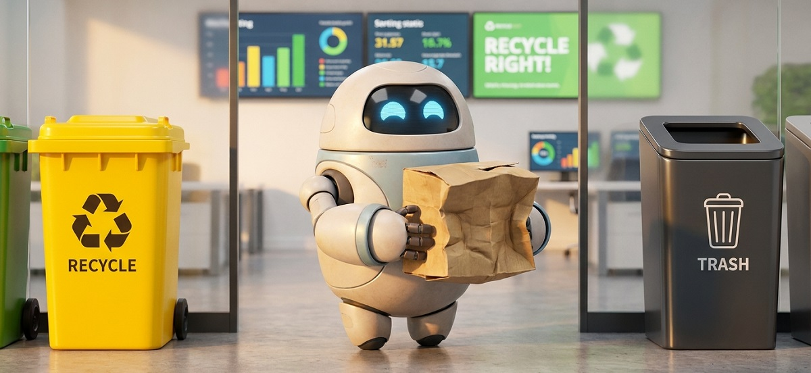
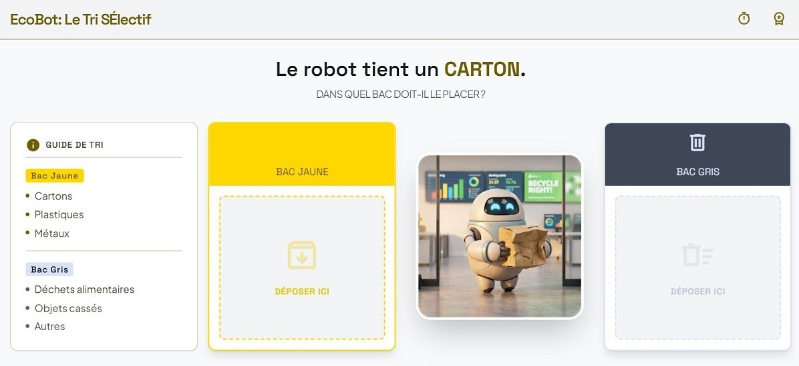

## Évaluation : Trier ses ordures 

**Objectif :** Modéliser un processus physique avec une notion de tri sélectif.

J'ai des déchets à jeter, j'envoie mon robot effectuer cette tâche.

Le robot est en possession des déchets à jeter et se trouve devant les poubelles. 

Quelles actions et décision doit-il prendre pour jeter les ordures dans le bac approprié ?

- La poubelle jaune est destinée à réceptionner les déchets valorisables (carton, plasique etc..).
- La poubelle grise accepte tous les autres déchets.

### Travail à réaliser

- Rédiger les scénarios
- Dessiner l'organigramme
- Rédiger le pseudo-code correspondant.

> Rappel: pensez à bien détailler toutes les étapes nécessaires. N'oubliez pas qu'il s'agit d'un robot, une étape manquante et c'est le drame...